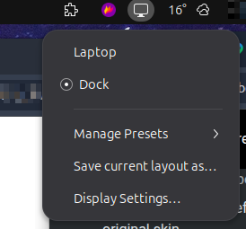

# Mutter Display Presets Indicator

A GTK3 + AppIndicator system tray applet for switching between saved display
layouts (monitor configurations) on GNOME Shell / Wayland, built on top of
[mutter-display-presets](https://github.com/alexdemb/mutter-display-presets).



## Features

- Dynamic preset list read from `mutter-display-presets`' own config — no
  hardcoded presets.
- Single-click apply: click a preset in the menu and it's applied
  immediately. The active preset is marked with a radio dot.
- **Manage Presets** submenu per preset:
  - per-output resolution/refresh-rate summary
  - **Update with current layout** — overwrite the preset with what's
    currently on screen
  - **Rename…**
  - **Delete…**
- **Save current layout as…** — save the current monitor configuration as a
  new preset.
- **Display Settings…** — opens GNOME's Display settings panel directly.
- Detects a missing `mutter-display-presets` CLI and offers an install link
  instead of a broken menu.
- All calls to the CLI are async (`Gio.Subprocess`), so a slow or stuck
  D-Bus call never freezes the tray icon.

## Requirements

- GNOME Shell on Wayland with AppIndicator support (e.g. the
  `ubuntu-appindicators` extension, already the default on Ubuntu).
- Python 3 with PyGObject (`python3-gi`), GTK 3, and
  `gir1.2-ayatanaappindicator3-0.1`.
- [mutter-display-presets](https://github.com/alexdemb/mutter-display-presets)
  installed and on `$PATH` (or at `~/.local/bin/mutter-display-presets`).
  If it's missing, the tray menu will tell you and link here.

## Install

```bash
ln -sf "$(pwd)/display-switcher.py" ~/.local/bin/display-switcher.py
chmod +x ~/.local/bin/display-switcher.py
```

Autostart entry (`~/.config/autostart/display-switcher.desktop`):

```ini
[Desktop Entry]
Type=Application
Name=Display Profile Switcher
Exec=/home/giray/.local/bin/display-switcher.py
X-GNOME-Autostart-enabled=true
```

Since this is a standalone tray application (not a GNOME Shell extension),
picking up code changes just means restarting the process — no logout
required:

```bash
pkill -f display-switcher.py
setsid ~/.local/bin/display-switcher.py >/dev/null 2>&1 &
disown
```

## Data locations

- Presets are stored by `mutter-display-presets` itself, at
  `$XDG_CONFIG_HOME/display-presets.json` (default
  `~/.config/display-presets.json`).
- The indicator remembers which preset it last applied at
  `~/.local/state/display-switcher/current-preset`, purely for marking the
  active radio item on the next launch — the CLI has no notion of a
  "currently active" preset.

## Versioning

Semantic versioning (`MAJOR.MINOR.PATCH`), tracked via git tags and the
`VERSION` constant at the top of `display-switcher.py`.
